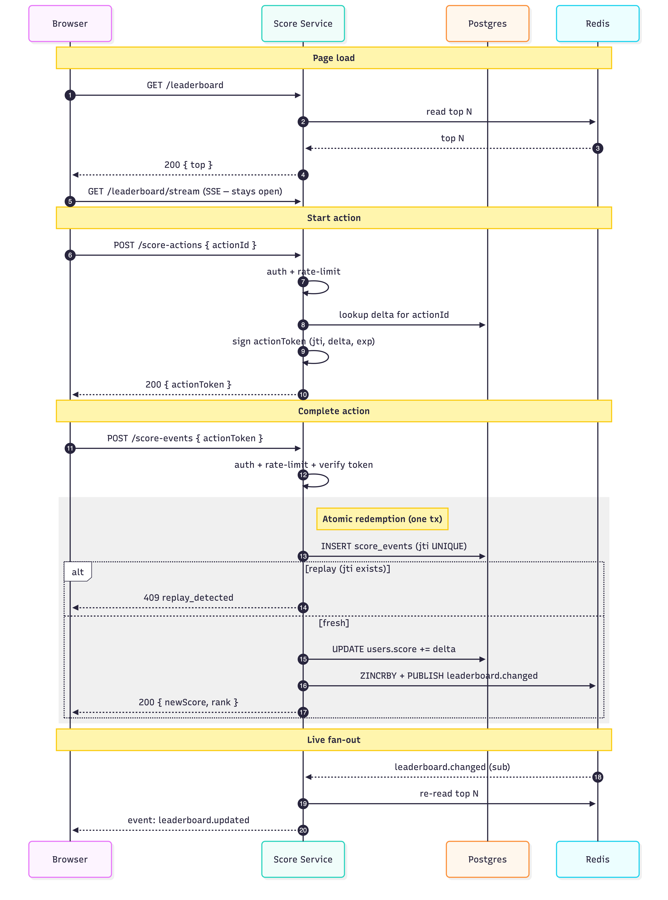
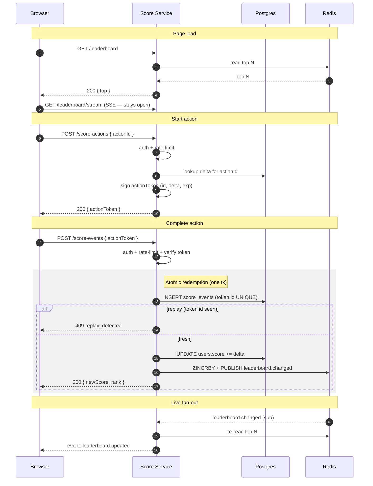

# Problem 6 — Score Service Module Specification

A specification for the **Score Service** module of an existing API server.
This document is intended as a hand-off to the backend engineering team that
will implement it.

---

## 1. Overview

The Score Service is responsible for:

1. **Mutating user scores** in response to a completed user action.
2. **Serving the live Top-10 leaderboard** to the website.
3. **Pushing leaderboard changes in real time** to connected clients.
4. **Preventing unauthorised or fraudulent score inflation.**

The service is a module inside the existing application server (e.g. a NestJS
module or an Express router) and shares the host app's authentication layer,
database connection, and observability stack.

### Non-goals

- The nature of the "action" itself (game level, quiz answer, etc.) — that is
  produced by a separate domain module and is opaque to this service.
- User registration / profile management.
- Historical analytics dashboards (audit log is written but not queried here).

---

## 2. Software requirements (restated)

| # | Requirement                                                                  |
|---|------------------------------------------------------------------------------|
| 1 | Website shows the top-10 user scores.                                        |
| 2 | The scoreboard updates **live** (no manual refresh).                         |
| 3 | A user action increases the user's score.                                    |
| 4 | On action completion the client calls the API to record the score change.   |
| 5 | Malicious users must not be able to increase scores without authorisation.   |

---

## 3. Data model

PostgreSQL (or whatever the host app uses). All column names are snake_case.

### `users`
The host app's existing `users` table gains two columns owned by this module:

| Column            | Type                                | Notes                                                  |
|-------------------|-------------------------------------|--------------------------------------------------------|
| id                | uuid PK                             | (existing)                                             |
| username          | text                                | (existing)                                             |
| score             | bigint NOT NULL DEFAULT 0           | **added** — current cumulative score                   |
| score_updated_at  | timestamptz NOT NULL DEFAULT now()  | **added** — last mutation time, ordering tie-breaker   |

Index: `(score DESC, score_updated_at ASC)` to support fast top-N reads even
if Redis is unavailable.

### `action_configs`
Server-side mapping from `actionId` to its points value. Populated by ops or
a sibling domain service; read-only from the score service's perspective.

| Column        | Type                       | Notes                                         |
|---------------|----------------------------|-----------------------------------------------|
| action_id     | text PK                    | e.g. `level-42-completed`                     |
| delta         | int NOT NULL CHECK (delta > 0) | Points awarded for this action            |
| active        | bool NOT NULL DEFAULT true | Set to `false` to disable awarding            |
| updated_at    | timestamptz NOT NULL DEFAULT now() |                                       |

> Alternative: an in-memory / Redis hash if the action set is small and
> changes infrequently. The schema is identical in either case.

### `score_events` (audit log + idempotency)
| Column         | Type        | Notes                                            |
|----------------|-------------|--------------------------------------------------|
| id             | uuid PK     |                                                  |
| user_id        | uuid FK     | references `users.id`                            |
| action_id      | text        | client-supplied action identifier                |
| delta          | int NOT NULL CHECK (delta > 0) | how much the score changed       |
| action_token_jti | text UNIQUE | server-issued JWT id — enforces single redemption |
| created_at     | timestamptz NOT NULL DEFAULT now() |                           |

`action_token_jti` is `UNIQUE`. Re-submission of the same token is rejected
by the database constraint — this is the primary anti-replay defense.

### Cache

Redis sorted set `leaderboard:global`:
- Member = `user_id`, Score = current `score`.
- `ZINCRBY leaderboard:global delta user_id` on each event.
- `ZREVRANGE leaderboard:global 0 9 WITHSCORES` for the top-10 read.

If Redis is unavailable, the service degrades gracefully by reading from
Postgres (`ORDER BY score DESC LIMIT 10`).

---

## 4. API Specification

All endpoints are mounted under `/api/v1`. Responses are JSON.

### 4.1 `POST /score-actions`
Issues a single-use **action token** that the client must redeem on
completion. Requires JWT auth.

**Request**
```json
{ "actionId": "level-42-completed" }
```

**Response 200**
```json
{
  "actionToken": "<jwt>",
  "expiresAt": "2026-05-12T11:30:00Z"
}
```

**Notes**
- The token is a JWT signed with a server-side secret (HMAC SHA-256 with a
  rotatable key, or RS256 if the secret cannot be co-located with verifiers).
- Claims:
  - `sub`: user id (must match the caller's session)
  - `aid`: `actionId`
  - `delta`: **points awarded on redemption — determined server-side, not
    by the client.** Looked up from the action config table (or computed
    per-action by a domain service) at token-issue time.
  - `jti`: random nonce — serves as the **idempotency key** (see §4.5)
  - `iat`, `exp`: short TTL, e.g. 5 minutes
- Storing the token plaintext on the client is fine — it's bound to the user
  and single-use.
- The token is opaque to the client. The client cannot read or modify any
  claim; the JWT signature would fail verification on redemption.

**Server logic**

1. **Auth.** Verify the session JWT → resolve `userId`. If missing/invalid →
   `401 unauthenticated`.
2. **Apply rate limit** for `POST /score-actions` (§6). Denied →
   `429 rate_limited` with `Retry-After`.
3. **Lookup action.** `SELECT delta, active FROM action_configs WHERE action_id = aid`.
   - Not found → `404 unknown_action`.
   - `active = false` → `409 action_disabled`.
4. **(Optional) Action-repeat policy.** If product wants "once per user" or
   "once per period", check `score_events` for an existing redemption now and
   return `409 action_already_completed` if applicable. *(Not in v1 by
   default.)*
5. **Mint token.** Build claims `{ sub: userId, aid, delta, jti: randomUUID(),
   iat: now, exp: now + tbd }`. Sign with the active `kid`.
6. **Respond** `200 { actionToken, expiresAt }`.

The handler does no writes to `users` or `score_events`; the token issue is
in-memory + DB read only.

### 4.2 `POST /score-events`
Records that an action completed and adds the **server-determined** delta
(read from the action token) to the user's score. Requires JWT auth and a
valid action token.

**Request**
```json
{
  "actionToken": "<jwt issued by /score-actions>"
}
```

> **Note:** the request does **not** carry a `delta`. The points awarded
> are read from the signed `delta` claim inside the action token — see §4.1
> and §5. This is the primary defence against requirement #5.

**Response 200**
```json
{
  "userId": "…",
  "newScore": 1234,
  "rank": 4,
  "appliedDelta": 10
}
```

**Errors**
| Status | Code (in body)               | When                                                  |
|--------|------------------------------|-------------------------------------------------------|
| 400    | `invalid_request`            | `actionToken` missing or malformed.                   |
| 401    | `unauthenticated`            | Missing / invalid session JWT.                        |
| 401    | `invalid_signature`          | `actionToken` signature does not verify.              |
| 403    | `subject_mismatch`           | `actionToken.sub` does not match the session user.    |
| 409    | `replay_detected`            | `actionToken` already redeemed.                       |
| 410    | `action_token_expired`       | `actionToken` past its `exp`.                         |
| 429    | `rate_limited`               | Per-user rate limit exceeded — see §6.                |

All error responses share the shape:
```json
{
  "error": {
    "code": "replay_detected",
    "message": "This action token has already been redeemed.",
    "requestId": "req_01HXY…"
  }
}
```

**Server logic**

1. **Auth.** Verify the session JWT → resolve `userId`. Missing/invalid →
   `401 unauthenticated`.
2. **Apply rate limit** for `POST /score-events` (§6). Denied →
   `429 rate_limited` with `Retry-After`.
3. **Verify the action token.**
   - Decode and check signature with the `kid` from the header. Bad signature →
     `401 invalid_signature`.
   - `now > exp` → `410 action_token_expired`.
   - `claims.sub !== userId` → `403 subject_mismatch`.
4. **Extract `delta`** from the verified claim — *never* from the request body.
5. **Atomic redemption inside one Postgres transaction:**
   ```
   BEGIN;
     INSERT INTO score_events (user_id, action_id, delta, action_token_jti, ...)
       VALUES (userId, claims.aid, claims.delta, claims.jti, ...);
     -- unique violation on action_token_jti → ROLLBACK, return 409 replay_detected
     UPDATE users
        SET score = score + claims.delta,
            score_updated_at = now()
      WHERE id = userId;
   COMMIT;
   ```
6. **Cache update (best-effort, retried):**
   `ZINCRBY leaderboard:global claims.delta userId`. If Redis is unavailable,
   log and continue — the reconciliation job (§8.1) will repair it.
7. **Fan-out:** `PUBLISH leaderboard.changed ""`. Subscribers (§4.4) re-read
   the top-10 and push to connected clients.
8. **Compute response.**
   - `newScore` from the `UPDATE ... RETURNING score` clause.
   - `rank` = `ZREVRANK leaderboard:global userId + 1` (or Postgres
     `SELECT COUNT(*) FROM users WHERE score > newScore + 1` as fallback).
9. **Respond** `200 { userId, newScore, rank, appliedDelta }`.

Steps 6–7 happen **after** the DB commit. If they fail, the user's score is
still correct in Postgres; Redis catches up via retry (transient) or the
periodic reconciliation job (§8.1) — at no point can the leaderboard show
points that aren't actually credited. See §8.1 for the full consistency
discussion.

### 4.3 `GET /leaderboard`
Returns the current leaderboard. Public (no auth required) — same data that
the scoreboard subscribes to in real time.

**Query parameters**

| Param  | Type | Default | Notes                                  |
|--------|------|---------|----------------------------------------|
| `limit`| int  | 10      | 1–100. Caps the number of rows returned. |

**Response 200**
```json
{
  "top": [
    { "rank": 1, "userId": "…", "username": "alice", "score": 9999 },
    …
  ],
  "generatedAt": "2026-05-12T11:30:00Z"
}
```

**Server logic**

1. **Apply rate limit** by IP (§6). Denied → `429 rate_limited`.
2. **Parse `limit`** (default 10, clamp to [1, 100]).
3. **Try Redis first** — the cache is the hot path.
   ```
   ZREVRANGE leaderboard:global 0 (limit-1) WITHSCORES
   ```
   - **Hit** (≥ 1 member returned) → go to step 5.
   - **Empty result** (`leaderboard:global` doesn't exist or is empty) → go
     to step 4. (This happens after a cold start, a Redis flush, or before
     the first reconciliation.)
   - **Redis unreachable / error** → go to step 4.
4. **Fall back to Postgres.**
   ```sql
   SELECT id, username, score
     FROM users
    ORDER BY score DESC, score_updated_at ASC
    LIMIT $1;
   ```
   On the *Redis-empty* path, also enqueue a one-shot job to repopulate
   `leaderboard:global` so subsequent reads hit the cache.
5. **Hydrate usernames.** If we came from Redis, the ZSET only stores
   `(user_id, score)`. Issue one batch `SELECT id, username FROM users WHERE id = ANY($1)`
   to attach display names. (Optional: cache username→id at the gateway.)
6. **Shape and respond** `200 { top: [...], generatedAt }`.

**Caching headers**:
- Normal path: `Cache-Control: public, max-age=2` — collapses CDN bursts.
- Degraded path (Postgres fallback): `Cache-Control: public, max-age=5` — a
  little more cache to spare the DB.

### 4.4 `GET /leaderboard/stream` *(real-time channel)*
**Server-Sent Events.** Used by the website to receive live top-10 updates.

```
GET /leaderboard/stream
Accept: text/event-stream
```

Server pushes one event per change. Payload identical to `GET /leaderboard`.

```
event: leaderboard.updated
data: { "top": [...], "generatedAt": "…" }
```

**Server logic**

The handler relies on a singleton **LeaderboardBus** that lives for the
lifetime of each API pod and does the fan-in/fan-out work.

**On API pod startup (once):**

1. Open a dedicated Redis connection in subscribe mode:
   `SUBSCRIBE leaderboard.changed`.
2. On every message received, the bus:
   - Re-reads the top-10 from Redis (`ZREVRANGE 0 9`) and hydrates usernames
     exactly like §4.3.
   - Compares the serialized payload to the last broadcast. If unchanged →
     **drops the event** (avoids spamming clients when a low-rank user
     scores).
   - Pushes the new payload onto an internal `Subject<MessageEvent>`.

**On each `GET /leaderboard/stream` request:**

1. **Auth gate (optional).** If product wants the stream gated, verify
   session JWT here. Default v1: public.
2. **Per-user concurrency cap** (§6). Reject with `429 too_many_streams`
   if the user already has the max allowed open SSE connections.
3. **Open SSE response.** Set headers:
   ```
   200 OK
   Content-Type: text/event-stream
   Cache-Control: no-cache, no-transform
   Connection: keep-alive
   ```
4. **Send the initial snapshot.** Immediately push one
   `event: leaderboard.updated` with the current top-10 so the client renders
   before any change occurs.
5. **Subscribe to the bus.** Each subsequent value from
   `LeaderboardBus.updates$` is written to this connection as an SSE event.
6. **Heartbeat.** Every 25 s, write a comment line (`:` + `\n\n`) so proxies
   and load balancers don't time out the connection.
7. **On client disconnect** (TCP FIN / abort), unsubscribe from the bus and
   release the connection slot from step 2.

> The bus does **one** Redis subscription per pod, not one per browser
> connection. N browsers connected to the same pod share the same upstream
> subscription — the only per-connection cost is the open TCP socket + the
> bus subscription handle.

> **Why SSE and not WebSocket?** Traffic is one-way (server → client), SSE is
> trivial to scale behind a reverse proxy, and most browsers handle it
> natively. If the team standardises on WebSockets elsewhere, use a
> `wss://…/leaderboard` channel with the same payload — the contract is the
> same.

### 4.5 Idempotency model

Each action token carries a random per-token id (the JWT `jti` claim). That
id is the **idempotency key** — persisted in `score_events.action_token_jti`
with a `UNIQUE` constraint. Re-submitting the same token always lands on
the same row, so:

- The first request to win the constraint race credits the score.
- Any later request with the same token gets `409 replay_detected`.

**Client retries are safe.** If the network drops the response, the client
may safely retry `POST /score-events` with the same token. A `409` on retry
is success-equivalent (the score was already credited) — the client re-reads
`GET /leaderboard` or relies on the SSE update for the new state.

> **Why a separate token id rather than the whole token as the key?** JWT
> signatures are deterministic over claims; without a nonce, two tokens
> issued for the same `(user, action)` in the same second would be
> byte-identical. The per-token id (`jti`, RFC 7519 §4.1.7) is the small,
> indexable handle that guarantees per-token uniqueness.

> **`Idempotency-Key` header is optional.** Clients wanting full end-to-end
> retry semantics MAY also send an `Idempotency-Key: <uuid>` header; the
> server would then cache the response for 24 h. *Not required for v1.*

---

## 5. Authentication & anti-fraud

Five layers, from cheapest to strongest:

1. **Session JWT** on every request — confirms the caller's identity.
2. **Action token (JWT, single-use, short TTL)** — proves the user actually
   started the action in question. Issued by `/score-actions`, redeemed by
   `/score-events`. Bound to user + action + signed delta + nonce.
3. **Server-determined `delta`** — the points awarded are *never* taken from
   the request body. They are baked into the signed `delta` claim of the
   action token at issue time, based on the `actionId` (lookup in an action
   config table). The client cannot forge or alter this value.
4. **DB-enforced single-use** via the `UNIQUE` constraint on the token-id
   column — replay returns 409 even under race conditions (two concurrent
   submits of the same token).
5. **Per-user rate limit** — see §6.

### 5.1 Action-token lifecycle

```
issued ──redeem──► consumed (row exists in score_events)
   │
   ├──exp──► expired (rejected with 410)
   │
   └──key_rotation──► invalid (signature check fails; rejected with 401)
```

- **Single-use:** once redeemed, the same token cannot be used again.
- **Expiry:** 5-minute TTL — long enough for a slow action, short enough that
  a stolen token has limited blast radius.
- **Key rotation:** signing keys are versioned (`kid` header). At rotation,
  in-flight tokens signed with the previous key remain valid until their
  natural expiry; new tokens use the new key.

### 5.2 Threat model

| Threat                                              | Mitigation                                |
|-----------------------------------------------------|-------------------------------------------|
| Direct call to `/score-events` without UI              | Action token required                     |
| Replay of a captured action token                   | DB `UNIQUE` constraint on token id + 409  |
| Token forgery                                       | JWT signature with server-side secret     |
| Stolen session                                      | Out of scope here; relies on host auth    |
| Inflated `delta` ("complete level for +999999")     | `delta` is set server-side and signed into the action token; client request has no `delta` field |
| Botnet / scripted clients                           | Rate limit (§6) + anomaly monitoring      |
| Token issued for user A, redeemed by user B         | `actionToken.sub` must match session user (403) |
| Long-running attacks using one stolen token         | 5-minute expiry on `exp` (410)            |
| Compromised signing key                             | `kid` versioning + rotation               |

---

## 6. Rate limiting

Apply rate limiting to every public endpoint to absorb retry storms and
dampen abuse. The exact algorithm is an implementation detail — the API
contract is just: on exhaustion, return `429 rate_limited` with a
`Retry-After` header.

**Suggested buckets (v1 defaults — product-tunable):**

| Endpoint                       | Bucket key      | Suggested limit |
|--------------------------------|-----------------|-----------------|
| `POST /score-events`              | per `userId`    | 60 / minute     |
| `POST /score-actions`          | per `userId`    | 120 / minute    |
| `GET /leaderboard`         | per `ip`        | 600 / minute    |
| `GET /leaderboard/stream`      | per `userId`    | max 3 concurrent connections |

**Implementation — Redis vs in-app.**

- **Redis-backed (recommended).** Limits are shared across all API pods, so
  horizontal scaling doesn't dilute them. Pick any well-known package
  (`@nestjs/throttler` with the Redis storage adapter,
  `rate-limiter-flexible`, or a small Lua token-bucket script). Use a key
  per bucket (e.g. `rl:incr:{userId}`). This is what the spec assumes
  elsewhere.
- **In-app / per-pod.** Acceptable for single-instance deployments or when
  Redis latency dominates the request budget. Trades the global guarantee
  for simplicity.

Whatever the choice, the rest of the spec only depends on the `429` contract.

---

## 7. Flow of execution



<details>
<summary>Mermaid source</summary>



</details>

### Notes on the flow
- The **rate-limit check** runs before any DB work — cheap rejection of abuse
  before we burn a transaction.
- The unique-token-id constraint is the crucial atomicity guarantee: it
  prevents a double-credit even if two requests arrive simultaneously, and
  it makes client retries safe (see §4.5).
- The Redis publish carries only an event marker; the live channel re-reads
  the top-10 to keep the message small and avoid stale broadcasts.
- The live channel **only emits** when the top-10 *membership* or *order*
  changes — not on every increment. This avoids spamming clients when low-rank
  users earn points.

---

## 8. Operational concerns

### 8.1 Consistency model (Postgres ↔ Redis)

Postgres is the **source of truth** for scores. Redis is a **cache** that
serves the hot read path (`GET /leaderboard` and the live channel).
Writes flow:

```
Client → API → Postgres tx (commit) → Redis ZINCRBY → Redis PUBLISH
            └─────────  source of truth ─────────┘   └── cache + fan-out ──┘
```

The DB write happens **first** so that a Redis failure can never produce an
inflated leaderboard. The worst case is a brief lag where Postgres has a
score that Redis hasn't reflected yet — never the reverse.

**Dual-write hazards and mitigations:**

| Failure                                       | What we do                                                              |
|-----------------------------------------------|-------------------------------------------------------------------------|
| DB commit fails                               | Return 5xx to client; no Redis write attempted. Nothing to reconcile.   |
| DB commits, then `ZINCRBY` fails (transient)  | Retry inside the request handler with exponential backoff (3 attempts, ~50/200/800 ms). Log on final failure. |
| DB commits, Redis fully unavailable           | Return 200 to client (their score *is* recorded). Background reconciler closes the gap. |
| Process crashes between DB commit and ZINCRBY | Same as Redis unavailable — reconciler corrects on next pass.           |

**Periodic reconciler.** A lightweight cron job (every 5 min in v1) rebuilds
the leaderboard from Postgres:

```sql
SELECT id, score FROM users ORDER BY score DESC LIMIT N;
```

then issues a single Redis pipeline that overwrites the top-N ZSET members.
This is cheap, idempotent, and corrects any drift no matter the cause.

**Why not transactional outbox?** It's stronger but adds a table, a worker,
and operational overhead. Retry + reconcile gives us "eventual consistency
within minutes" for free, and for a leaderboard that's plenty. If product
later requires sub-second consistency under failure, swap in the outbox
pattern — the API contract doesn't change.

### 8.2 Outages — what still works when a dependency dies

**If Redis dies:**

| Endpoint                       | Behavior                                                                 |
|--------------------------------|--------------------------------------------------------------------------|
| `POST /score-actions`          | Still works. Rate-limit fails closed → `503 Retry-After: 5`, or fails open if the team prefers (acceptable for non-mutating endpoint). |
| `POST /score-events`              | Still works at the DB level (source of truth). Skips `ZINCRBY` and `PUBLISH`; the reconciler (§8.1) repairs the leaderboard later. Rate-limit fails closed → `503 Retry-After: 5`. |
| `GET /leaderboard`         | Still works. Falls back to Postgres (`ORDER BY score DESC LIMIT 10`) with `Cache-Control: public, max-age=5`. |
| `GET /leaderboard/stream`      | Cannot deliver live updates (pub/sub is gone). Server emits a final `event: degraded\ndata: {"poll":"5s"}` and closes; clients fall back to polling `/leaderboard`. |

**If Postgres dies:** all write endpoints return `503`. Reads from Redis
continue (the ZSET is fully usable), with usernames optionally cached at the
gateway.

**Both up but disagree:** the reconciler (§8.1) reconciles every 5 min by
rebuilding the leaderboard ZSET from Postgres. Worst-case staleness window
is one reconcile interval.

---

## 9. Improvements (out of scope for v1)

Hand-off notes for the implementing team — items worth scheduling after the
v1 cut.

### 9.1 Graceful shutdown & connection draining

SSE makes pod lifecycle non-trivial: a rolling deploy, autoscaler
scale-in, or node drain terminates long-lived connections and risks
tearing in-flight score writes. The shutdown sequence:

1. **Receive `SIGTERM`** from the orchestrator.
2. **Fail readiness probe.** Load balancer stops routing new traffic;
   existing in-flight requests continue.
3. **Drain regular HTTP** for up to `SHUTDOWN_TIMEOUT` (e.g. 15 s). Let
   in-flight `POST /score-events` and `GET /leaderboard` requests finish;
   reject new ones with `503 service_unavailable`.
4. **Notify SSE clients explicitly.** For each open `/leaderboard/stream`
   connection, send a final event and close:
   ```
   event: shutdown
   data: {"reconnect": true}
   ```
   `EventSource` reconnects automatically on close, but the explicit signal
   lets clients re-attach to a healthy pod immediately instead of waiting
   on the default ~3 s backoff.
5. **Close the Redis subscriber** so the pub/sub channel doesn't linger.
6. **Drain the Postgres pool** — wait for in-flight transactions, then
   close idle connections.
7. **Exit.**

If step 3 exceeds the timeout, log the abandoned requests and force-close.
The unique-token-id constraint on `score_events` still prevents
double-credit if the client retries against another pod.

### 9.2 Anomaly detection & fraud revocation

Track increments-per-hour per user; on outliers, temporarily lock the
account. Provide an admin endpoint to zero out a user's `score_events` and
rebuild `users.score` from the remaining rows.

### 9.3 Per-leaderboard scoping

Spec models one global board. For daily / weekly / per-region boards, the
Redis key becomes `leaderboard:{scope}:{period}` and `score_events` gains a
`scope` column. Forward-compatible with the current schema.

### 9.4 Dedicated SSE gateway

SSE is fine to ~10k concurrent connections per Node.js pod. Beyond that,
move the live channel to a gateway service that holds one Redis
subscription and fans out, so API pods don't hold long-lived sockets. With
§9.1 in place, splitting the gateway is mostly a deployment change — the
wire protocol doesn't change.
